#Codename One

Codename One is a library and toolkit for developing native mobile applications.  It currently supports Android, iOS, Windows Phone, BlackBerry, and J2ME, but it could potentially be expanded to support any mobile OS.

It includes a java class library and a resource editor application for desiging user interfaces, themes, and managing other application resources.

##Features

 * Light-weight UI toolkit.
 * Advanced Theming support
 * Graphical GUI builder
 * Java 1.5 support
 * Cross platform APIs for many device features (e.g. GPS, media, Camera, etc…)
 * Cloud build option
 * Compiles to native.

## What do we mean by "native"

Though your code is written in Java, all code is ultimately compiled down to native machine code. The class library uses a facade pattern whereby all platform functionality is encapsulated by a single class "CodenameOneImplementation".  Each port subclasses this with its own implementation as follows

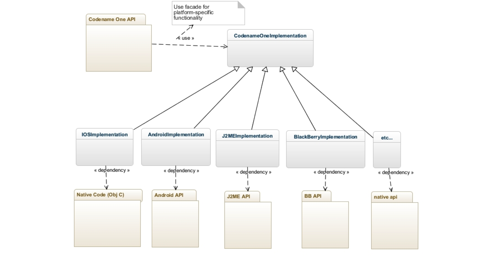

Different platforms use different mechanisms to produce native code.  E.g. iOS uses XMLVM to convert java to C, which is compiled directly using apple's build tools.  The Windows Phone build converts java to C sharp, then uses the standard Windows build tools for compiling to a native binary.

Performance-critical sections are hand-coded in the native langauge (e.g. C or Objective-C on iOS and C-Sharp on Win Phone).

## IDE Integration

Currently, Codename One supports all three major java IDEs:

* NetBeans
* Eclipse
* IntelliJ

I use Netbeans, so all of the examples today will be on NetBeans.  However you should be able to use the plugin for any of these.

## The Build Server

Because the build process is somewhat complex, Codename One (the company) hosts a build server where you send your application Jars to be built into native apps.  All parts of the toolchain are open source so you could set up your own local build process if you want to.  

E.g. I developed a Netbeans plugin to support local IOS builds [here](https://github.com/shannah/cn1-offline-ios-suite-nbm).  It, of course, requires that you have a Mac and have Xcode installed.

This leads to one of the benefits of using the build server:  You can do your development on any OS you want.  You can develop for iOS on Windows or Linux, and you can develop WinPhone on Mac.  The build process is handled by the build server.

### Do I send them my sources?

The build server converts your application jar to a native app.  It doesn't require your java source code.  Only the .class files (byte code).

### Build Server Speed

Depending on the target platform, the build server can be a little slow.  Android builds generally take 2 to 3 minutes.  iOS builds usually take 5 to 10 minutes.  This can really get in the way of productivity if you perform too many change/build/test cycles.  Luckily there is a JavaSE port (the simulator) that allows you to run your apps directly inside the IDE.  Build times with this are generally only a few seconds, and for most things it will be running exactly the same code as on the device - so it provides a good test environment.

# API Support

Codename One supports Java 1.5 syntax (e.g. it includes generics).  The class library includes a subset of the Java 1.5 API.  This includes most of the core classes in java.lang and java.util, but does not include a number of other packages such as java.net, java.awt, javax.swing, etc…  In addition some of the core classes (e.g. String and Math) are missing methods in order to maintain compatibility with J2ME.  In such cases, there are usually utility classes that provide equivalent functionality.  E.g.

* [String](https://codenameone.googlecode.com/svn/trunk/CodenameOne/javadoc/java/lang/String.html) is supplemented by [StringUtil](https://codenameone.googlecode.com/svn/trunk/CodenameOne/javadoc/com/codename1/util/StringUtil.html)
* [Math](https://codenameone.googlecode.com/svn/trunk/CodenameOne/javadoc/java/lang/Math.html) is supplemented by [MathUtil](https://codenameone.googlecode.com/svn/trunk/CodenameOne/javadoc/com/codename1/util/MathUtil.html)

In addition to the core Java classes, Codename One adds its own rich set of classes for things like user interface, networking, and accessing device features such as Camera, GPS, and playing Media.

**You should always use the Codename One Javadocs as the definitive source** for API information, whether you're looking up classes in java.lang or com.codename1.ui.

* [Codename One JavaDocs](http://www.codenameone.com/codename-one-api.html)

## Missing Functionality

If there is functionality that you require in your app that is not available in the API, there are a few possibilities for adding the functionality:

1. External Libraries - There is a growing number of external libraries made for Codename One that may include the functionality that you're looking for.
2. Native Interfaces - You can implement a native interface to access core functionality in the underlying device.  E.g. you could create a wrapper for an existing iOS framework if you are targeting iOS.
3. Web wrappers - Use a web browser component to wrap an existing javascript library which you can embed in your app.

# Hello World

This is what a bare-bones Codename One app looks like:

~~~
package ca.weblite.oscon.part1;

import com.codename1.ui.Display;
import com.codename1.ui.Form;
import com.codename1.ui.Label;
import com.codename1.ui.plaf.UIManager;
import com.codename1.ui.util.Resources;
import java.io.IOException;

public class Part1 {

    private Form current;

    public void init(Object context) {
        try {
            Resources theme = Resources.openLayered("/theme");
            UIManager.getInstance().setThemeProps(theme.getTheme(theme.getThemeResourceNames()[0]));
        } catch(IOException e){
            e.printStackTrace();
        }

    }
    
    public void start() {
        if(current != null){
            current.show();
            return;
        }
        Form hi = new Form("Hi World");
        hi.addComponent(new Label("Hi World"));
        hi.show();
    }

    public void stop() {
        current = Display.getInstance().getCurrent();
    }
    
    public void destroy() {
    }

}

~~~

(This is more or less the app code is generated by default when you create a new Codenmae One project in Netbeans).

It looks a lot like a Java Applet because mobile apps run inside containers just like Applets did.  (past tense because Applet's are pretty much dead now!).  The main class includes 4 methods:

* init() - called when the app is first loaded.
* start() - called when the app is loaded, and when it is re-activated (e.g. when switching back to the app already running)
* stop() - called when the app is closed or when it is put into the background.
* destry() - called with the app exits.

This example demonstrates a small portion of the UI toolkit, with the Form and Label classes.  It also shows a little bit of its theme capabilities. In the init method, it opens the resource file (theme.res) that is located inside the root of the src directory and includes some instructions re the look and feel of the app.

The start() method creates a new Form, adds a label to it, and shows the form.

The result looks like

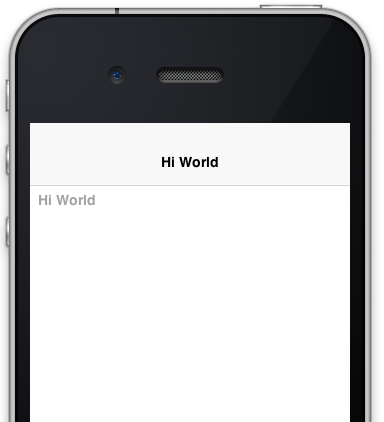

This screenshot was taken using the Simulator (i.e. "Run" the project in Netbeans) and it will open the simulator.  This is using the iPhone 3GS theme, but the simulator allows you to run it in any theme you like.  Just select the appropriate theme from the "Skins" menu.

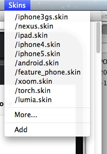

Selecting the "Android" skin will cause the app to look like:

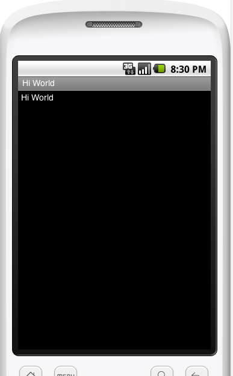

## Adding Controls

Let's make our app a little bit more interesting by adding a few of the components that are available to us.  E.g., Let's change the app so that it allows us to enter our name into a Text field, and a button to cause this to update the greeting.

Change the start method as follows:

~~~
    public void start() {
        if(current != null){
            current.show();
            return;
        }
        final Form hi = new Form("Hi World");
        final Label greeting = new Label("Hi");
        hi.addComponent(greeting);
        final TextField tf = new TextField();
        tf.setHint("Enter name");
        hi.addComponent(tf);
        Button b = new Button("Update");
        b.addActionListener(new ActionListener(){

            public void actionPerformed(ActionEvent evt) {
                greeting.setText("Hello "+tf.getText());
                // We need to revalidate the form because 
                // the greeting change may affect the layout
                hi.revalidate();
            }
            
        });
        hi.addComponent(b);
        hi.show();
    }
~~~

**Some things to notice here:**

*  We changed some variables to "final" so that they could be accessed inside the anonymous internal action listener.
*  We added a button and a text field.
*  We called Form.revalidate() after changing the greeting.  This was necessary because a longer greeting may change the layout requirements for the form.

Thee result should look like:

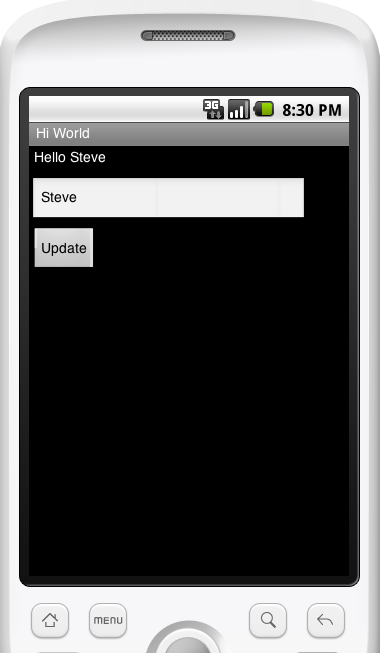

Try rotating the device (in the simulator you can select "Rotate" in the "Simulator" menu).

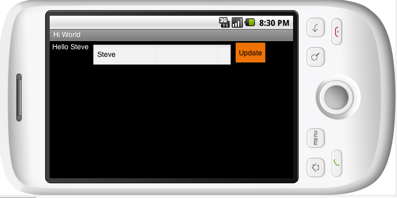

Notice that the rotated version has all three controls on the same line.  This is because the form is currently using the [FlowLayout](https://codenameone.googlecode.com/svn/trunk/CodenameOne/javadoc/com/codename1/ui/layouts/FlowLayout.html) to layout its children.  If we wanted to change it so that the controls are laid out, vertically we could change some code to:

~~~
final Form hi = new Form("Hi World");
hi.setLayout(new BoxLayout(BoxLayout.Y_AXIS));
~~~

Then the layout would change to:

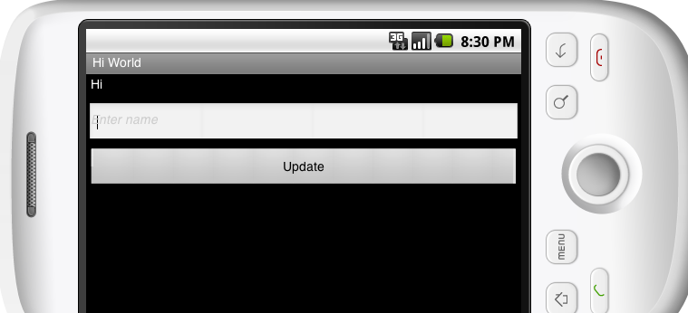

#The UI Component Model

The previous example gives us a glimpse of the Codename One component model.  The component model is clearly influenced by Swing.  The "Form" class is analogous to the "JFrame" class in Swing, as it encapsulates a full-screen form.  Each of the individual controls that we used (Buttons and Labels) are subclasses of the Component class.

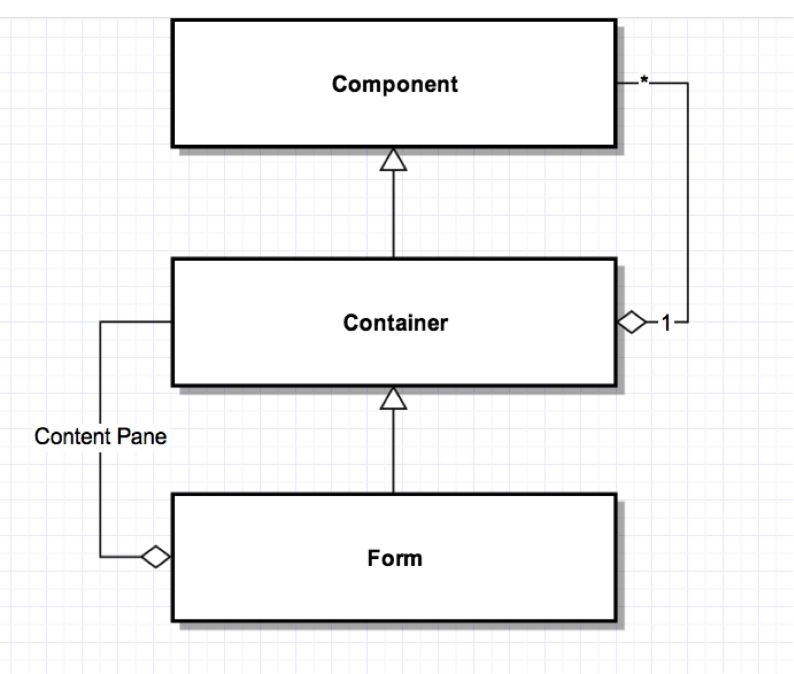

The Container class is the base class for all components that can have children.  As the diagram above shows, the Form class is, itself, a container.  

##Layouts

You can specify how a parent component organizes its children by adjusting its Layout.  This is done using 

``Container.setLayout(Layout)``

The CN1 class library includes most of the common layouts that cover 99% of the use-cases.  Some of these layouts include:

* BorderLayout
* FlowLayout
* GridLayout
* TableLayout
* LayeredLayout
* BoxLayout (Y_AXIS or X_AXIS).

You can read more about layouts [in this blog post](http://codenameone.blogspot.com/2012/06/understanding-layout-manager.html) or in the [javadocs](https://codenameone.googlecode.com/svn/trunk/CodenameOne/javadoc/com/codename1/ui/layouts/Layout.html) for Layout.

## Exercise 1

In this exercise we are going to build the following simple "To Do" application.  The app will allow the user to enter a "todo item" into the text field.  When they click "Add", it will add the item to the list of items below.

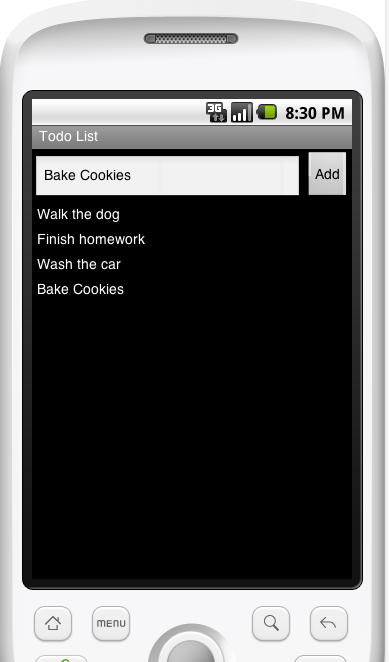

###Implementation Instructions

1. Use a BorderLayout for the form, and a Container with a BoxLayout for the list of Todo Items.

[Sample Solution](chapter1_solutions.md)

## Lists

Lists tend to come into play an awful lot with mobile applications.  For small lists (like with our Todo App), it may be fine to just use a Container with a BoxLayout to display a list of items.  But when the number of items in the list gets large (e.g. 100, 1000, or 100000), this can carry a prohibitive amount of overhead.  Codename One includes a List component that is extremely effecient at rendering large lists of data.  It uses a renderer approach similar (nearly exactly the same) to Swing.

The List component uses a List Model to store the data that is to be displayed in the list, and a List Renderer to handle the rendering of the data.  The list model is really just a glorified array with some added plumbing to inform the view when its data has been changed.  Codename One provides a DefaultListModel class that should be sufficient for most use cases.

###List Renderers

The list renderer works much like a printing press.  It keeps a small set (usually only one) of prototype components on hand, and paints it once for each row of the cell. This is much lighter on memory and the CPU because it doesn't have to create a separate component for each row.  It simply sets the appropriate values for the row in the prototype component, and then paints it in the appropraite space on the form.

***Advantages of using Lists***

* Faster rendering for large datasets.
* Lighter memory footprint

***Disadvantages of using Lists***

* Each row isn't actually a "live" component so event handling can be more tricky.
* Every row must be the same height

###Basic List Usage

To start using the List component you don't actually need to know anything about renderers or models.  You can just create the list.  For example:

~~~
Form hi = new Form("Countries");
        hi.setLayout(new BorderLayout());
        List list = new List(new String[]{
            "Canada", "France", "United States", "Spain", "Mexico", "Brazil", "Germany"
        });
        hi.addComponent(BorderLayout.CENTER, list);
        hi.show();
~~~

Which results in the following:

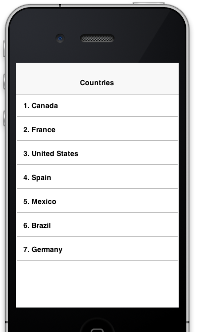

###Updating the List

Lists are always updated through their model but, the List class does include an ``addItem()`` method that wraps the model's "add" functionality if supported.  If you are updating the entire list or a good portion of the list, it may be more efficient to just change the model.

E.g.:

~~~
list.setModel(new DefaultListModel(new String[]{
            "Canada", "France", "United States", "Spain", "Mexico", "Brazil", "Germany"
        }));
~~~

###Handling List Events

Handling events in list items is slightly different than if each of the rows were their own component.  If you want to respond to events of a list item, you need to listen to the list itself, and then query the list to see which row is selected to determine which row was clicked.

For example:

~~~
        list.addActionListener(new ActionListener(){

            public void actionPerformed(ActionEvent evt) {
                String country = (String)list.getSelectedItem();
                Dialog.show(
                    "Click happened",    // title
                    "You clicked "+country,  // body
                    "OK", "Cancel" // buttons
                );
            }
            
        });
~~~~

##Exercise 2

Modify your app from example 1 so that it uses a list instead of a Container with BoxLayout for laying out the Todo Items.  In addition, make it so that if the user "long presses" on a todo item, it will prompt them whether to delete it.

You may want to refer to the [ActionEvent javadocs](https://codenameone.googlecode.com/svn/trunk/CodenameOne/javadoc/com/codename1/ui/events/ActionEvent.html) to detect whether the event was from a "long press".

[Sample Solution](chapter1_solutions.md#Exercise-2-Sample-Solution)

#Networking

Codename One doesn't include the java.net package because it would be quite difficult to port into non-Java platforms.  Instead it provides its own API for network requests.  There are two key classes for HTTP requests:

1. [ConnectionRequest](https://codenameone.googlecode.com/svn/trunk/CodenameOne/javadoc/com/codename1/io/ConnectionRequest.html) - Encapsulates a single HTTP request.
2. [NetworkManager](https://codenameone.googlecode.com/svn/trunk/CodenameOne/javadoc/com/codename1/io/NetworkManager.html) - A singleton class that manages all HTTP requests.  

##A Simple Example

~~~
public void start() {
        if(current != null){
            current.show();
            return;
        }
        Form hi = new Form("Countries");
        hi.setLayout(new BorderLayout());
        final List list = new List(new String[]{
            "Canada", "France", "United States", "Spain", "Mexico", "Brazil", "Germany"
        });
        
        list.addActionListener(new ActionListener(){

            public void actionPerformed(ActionEvent evt) {
                ConnectionRequest req = new ConnectionRequest();
                
                // Use this google web service to find out information about the 
                // selected country
                
                req.setUrl("http://maps.googleapis.com/maps/api/geocode/json?address="+Util.encodeUrl((String)list.getSelectedItem())+"&sensor=false");
                req.setPost(false);
                NetworkManager.getInstance().addToQueueAndWait(req);
                
                JSONParser json = new JSONParser();
                ByteArrayInputStream bs = null;
                try {
                    bs = new ByteArrayInputStream(req.getResponseData());
                    Map data = (Map)json.parseJSON(new InputStreamReader(bs, "UTF-8"));
                    Log.p("Results: "+data);
                    java.util.List results = (java.util.List)data.get("results");
                    Map result = (Map)results.get(0);
                    Map geometry = (Map)result.get("geometry");
                    Map location = (Map)geometry.get("location");
                    String lat = ""+location.get("lat");
                    String lng = ""+location.get("lng");
                    
                    Log.p("Location of "+list.getSelectedItem()+" is "+lat+","+lng);
                } catch (IOException ex) {
                    Log.e(ex);
                } finally {
                    if ( bs != null ){
                        try {
                            bs.close();
                        } catch ( Exception ex){}
                    }
                }
                
            }
            
        });
        hi.addComponent(BorderLayout.CENTER, list);
        hi.show();
        
        
    }
~~~

This example uses a Google Web Service to locate some geographic information about the selected country.  You can see the sample web service response for "Canada" [here](http://maps.googleapis.com/maps/api/geocode/json?address=Canada&sensor=false).

In this example, we parse this JSON response, and extract the location's latitude and longitude, then simply print it to the console (which you can only see in the netbeans debug console.

The JSON parsing in this example looks painful as it produces a structure of nested Maps and Lists, but this can be vastly simplified using the [Result](https://codenameone.googlecode.com/svn/trunk/CodenameOne/javadoc/index.html) class. It provides an XPATH-like query language to be able to obtain data that may be deeply nested inside a JSON structure.  I leave this to you as an exercise to figure out how to change the example to use Result.

###addToQueueAndWait() vs addToQueue()

In this example, we use the addToQueueAndWait() method to block until the request is done.  Normally this would be a big NO-NO:  blocking the event/UI thread while waiting for a network response.  With Codename One, however, it has a mechanism to allow for blocking of the event thread without actually blocking it.  Essentially it pauses this event dispatch, but spawns another event thread to run while this one is blocked.

Using the addToQueue() method instead will cause the request to be made asynchronously.  This means that the method will return before the request completes.  This is a different style of programming altogether.  As an experiment, let's try changing our code to make the request asynchronous.

Steps:

Derive the ConnectionRequest to override the readResponse() and postResponse() methods as follows:

~~~
                ConnectionRequest req = new ConnectionRequest(){

                    @Override
                    protected void readResponse(InputStream input) throws IOException {
                        super.readResponse(input);                     }

                    @Override
                    protected void postResponse() {
                        super.postResponse();
                    }
                    
                    
                };
~~~

The readResponse() method is called when the response is received.  This is where we can process the response's JSON data.  It is executed on the network thread - not the EDT (Event-Dispatch-Thread) so you should NOT interact with any user interface components in this method.

The postResponse() method is called after readResponse() is finished.  It is run on the EDT so this is where you can update the user interface.

Now move the processing code into the body of readResponse:

~~~
JSONParser json = new JSONParser();
                        Map data = (Map)json.parseJSON(new InputStreamReader(input, "UTF-8"));
                        Log.p("Results: "+data);
                        java.util.List results = (java.util.List)data.get("results");
                        Map result = (Map)results.get(0);
                        Map geometry = (Map)result.get("geometry");
                        Map location = (Map)geometry.get("location");
                        String lat = ""+location.get("lat");
                        String lng = ""+location.get("lng");

                        Log.p("Location of "+list.getSelectedItem()+" is "+lat+","+lng);
                        }

                        @Override
                        protected void postResponse() {
                            super.postResponse(); //To change body of generated methods, choose Tools | Templates.
                        }
~~~

If you run this app and click on "France", the output in the console should be:

~~~
[Network Thread] 0:0:0,0 - Results: {results=[{address_components=[{long_name=France, types=[country, political], short_name=FR}], formatted_address=France, types=[country, political], geometry={bounds={southwest={lng=-5.141227900000001, lat=41.3423276}, northeast={lng=9.560067799999999, lat=51.089166}}, viewport={southwest={lng=-4.795341899999999, lat=42.333014}, northeast={lng=8.2335491, lat=51.089166}}, location_type=APPROXIMATE, location={lng=2.213749, lat=46.227638}}}], status=OK}
[Network Thread] 0:0:0,3 - Location of France is 46.227638,2.213749
~~~

The "Network Thread" prefix on each log line indicates that the output was written on the Network thread.  The previous example would have said "EDT".

##The Event Dispatch Thread

I have so far just glossed over the concept of the "Event Dispatch Thread".  Most UI toolkits are single threaded and require you to use a single thread for accessing 

##Commands & Navigation

#Native Interfaces
#Libraries
#GUI Builder
## GUI Editor
###Navigation Exercise

*Part 1: Creating Forms in the GUI Builder*

Steps:

1.	Create a new “GUI Builder” project using the native theme.
2.	Open the “theme.res” file in the GUI builder.
3.	Select the “Main” form.
4.	Add 3 buttons to the form with labels “Canada”, “France”, and “Germany”
 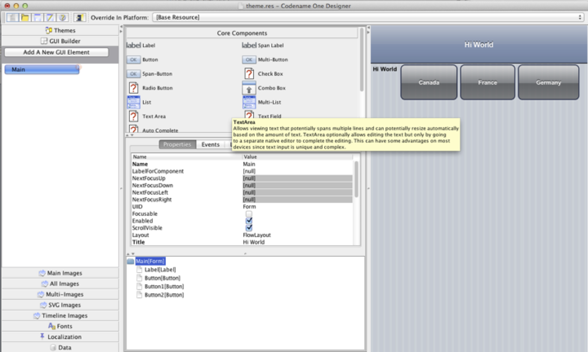
5.	Rename the buttons to “canadaBtn”, “franceBtn”, and “germanyBtn” respectively.
 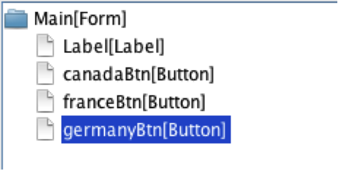
6.	Next we will add forms for each of our country.  We will start with the “Canada” form. 
a.	Click the “Add a New GUI Element” button.
 
b.	Enter “CanadaForm” for the name of the form, and “Blank Form” as the template.
 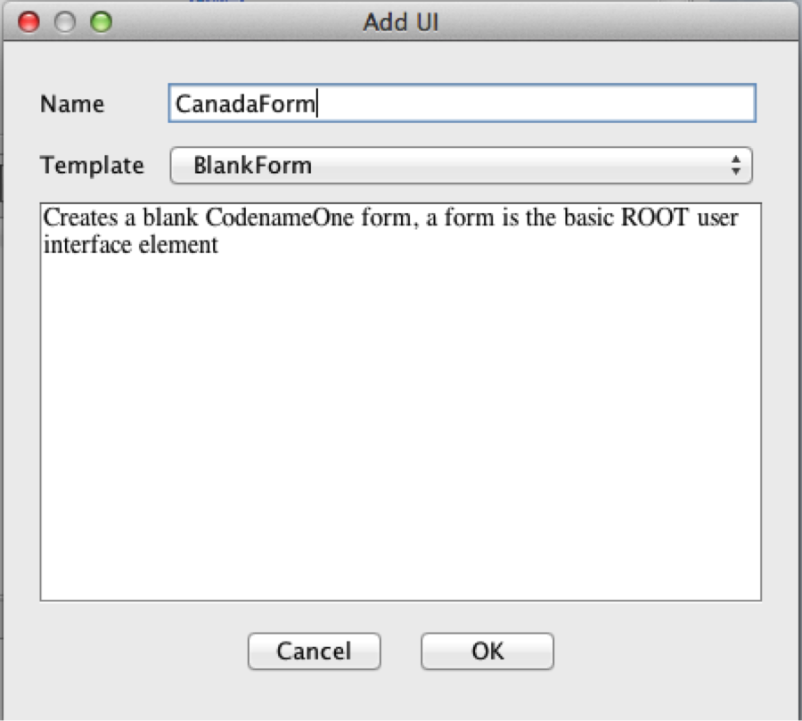
c.	Click “OK”.  This will create a new blank form as follows:
 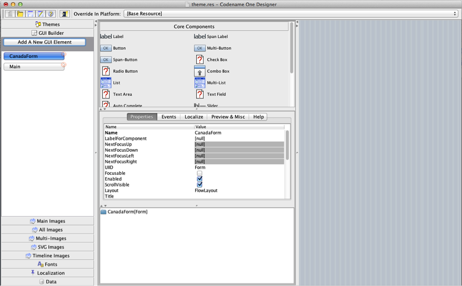
d.	Set the title of the form to “Canada”.   This can be done by scrolling to the row in the “Properties” inspector with name “Title”.
 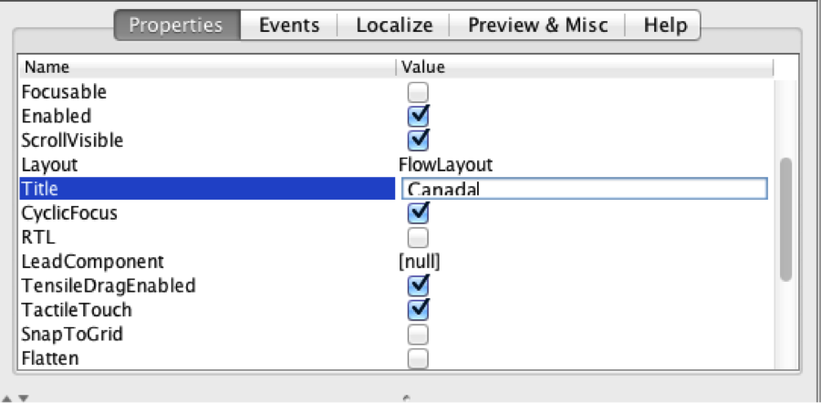
e.	Add a label to the form with the text “Hello Canada”.  At this point the form should look like the following screenshot: 
 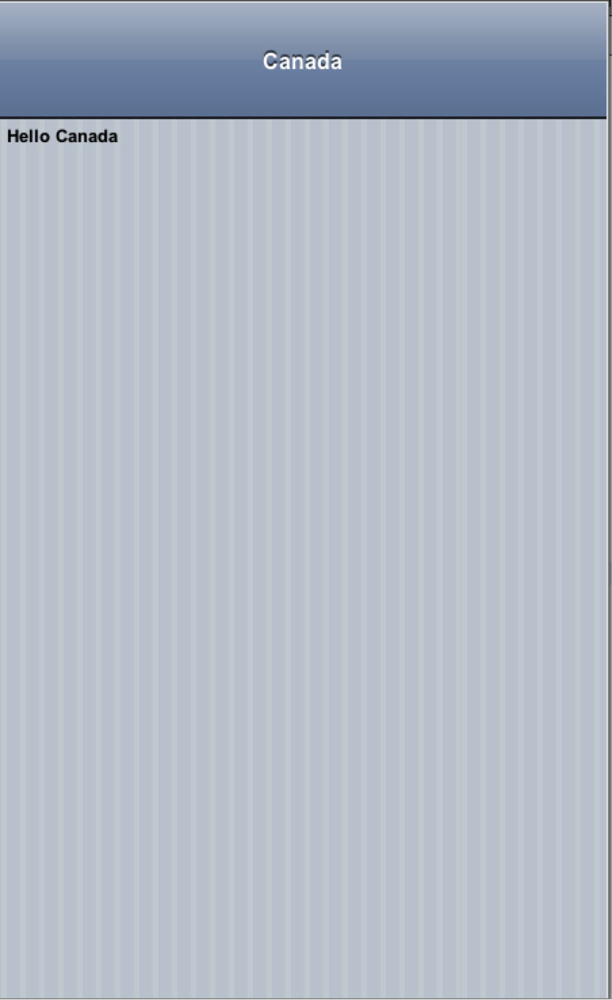
7.	Add similar forms for France and Germany using the same procedure that you used to add the Canada form.
8.	Once all 3 forms have been created, we will add functionality so that clicking on the buttons in the main form shows the corresponding form.
a.	Select the “Main” form again (the one with our buttons).
b.	Select the “Canada” button.
c.	Click on the “Events” tab of the property inspector.
 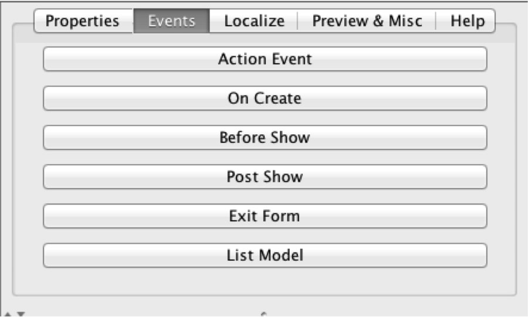
d.	Click on the “Action Event” button.  This should automatically add a method into your Statemachine class inside Netbeans.
e.	Save the resource file  (i.e. File > Save).
f.	Open the StateMachine class and add the method body for the method that was created:


 ~~~
@Override
    protected void onMain_CanadaBtnAction(Component c, ActionEvent event) {
        showForm("CanadaForm", null);
    
    }
 ~~~

 
9.	Add action event handlers for the other 2 buttons using the same procedure.
10.	Run the project in NetBeans

  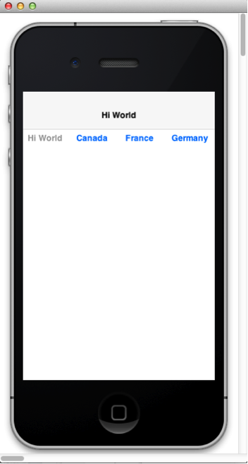

  
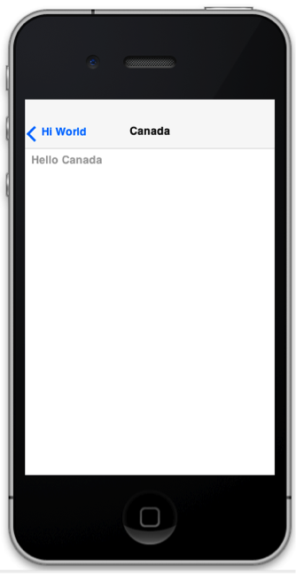

Notice that the country forms include a “Back” button to the main form.  This is automatically managed by the GUI builder.


Part 2: Creating Forms Programmatically

Steps:

1.	In the GUI builder, Add a button to the “Canada” form named “vancouverBtn” with label “Vancouver”.
2.	Add an action event handler for the Vancouver button using the same technique as our previous buttons.  And add the following code inside the handler.
 
~~~
@Override
    protected void onCanadaForm_VancouverBtnAction(Component c, ActionEvent event) {
        Form vancouverForm = new Form("Vancouver");
        vancouverForm.addComponent(new Label("Hello Vancouver"));
        
        vancouverForm.show();
    
    }
~~~
 
3.	Run the app.
4.	Navigate to the Vancouver form.  
 
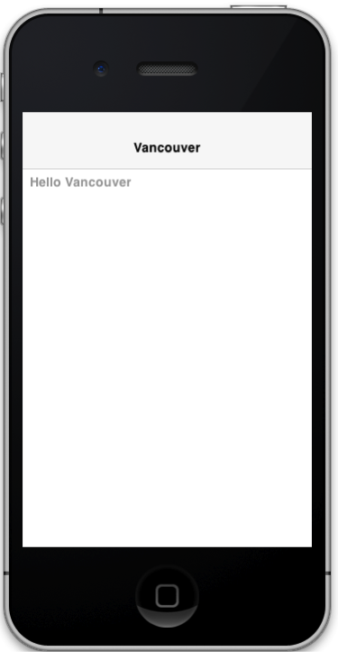
 
Notice that there is no “Back” button.  This is because we created the form manually so that automatic navigation control of the GUI builder is not in effect.  We can solve this by explicitly adding a “Back” command to the form as follows:
 

 ~~~
@Override
    protected void onCanadaForm_VancouverBtnAction(Component c, ActionEvent event) {
        Form vancouverForm = new Form("Vancouver");
        vancouverForm.addComponent(new Label("Hello Vancouver"));
        
        vancouverForm.setBackCommand(new Command("Canada"){

            @Override
            public void actionPerformed(ActionEvent evt) {
                back();
            }
            
        });
        
        vancouverForm.show();
    
    }
~~~

5.	Re-run the app.  You should now see a back button on the Vancouver form.  And it should return you to the Canada form.

***Part 3: Dialogs***

Now let’s warn the user before entering France that there may be some French on the form, and give the user the option to proceed or not.

Steps:

1.	Click “Add a New GUI Element” in the resource editor just as if you were going to add a new form.
2.	Enter “FranceWarningDialog” for the name and “AreYouSureDialog” for the template: 
 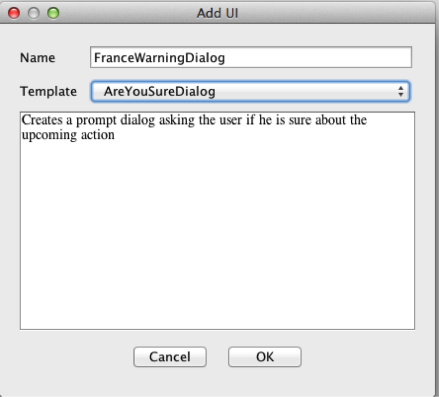
You should now see a blank dialog in the editor window.
 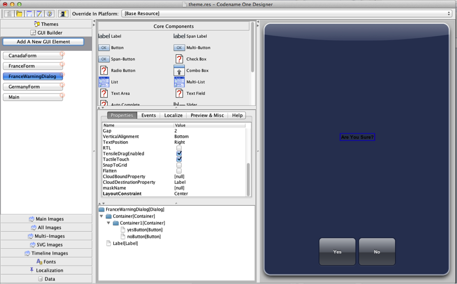
3.	Set the dialog title to “Are you sure?”
4.	Change the text of the label to say “They speak French in France.  Are you sure you want to proceed?”
5.	Add an action event handler to the “Yes” button that shows the FranceForm.
6.	Add an action event handler to the “No” button that hides the dialog as follows:
 

 ~~~
    @Override
    protected void onFranceWarningDialog_NoButtonAction(Component c, ActionEvent event) {
        
        Dialog dlg = (Dialog)c.getComponentForm();
        dlg.dispose();
    
    }
 ~~~
7.	Change the code in the “France” button action handler so show our dialog instead of going directly to the “France” form:
 
~~~
    @Override
    protected void onFranceWarningDialog_YesButtonAction(Component c, ActionEvent event) {
        showForm("FranceForm", null);
    
    }
~~~
 
8.	Run the app.  This time click the “France” button.  It should now show our dialog.
 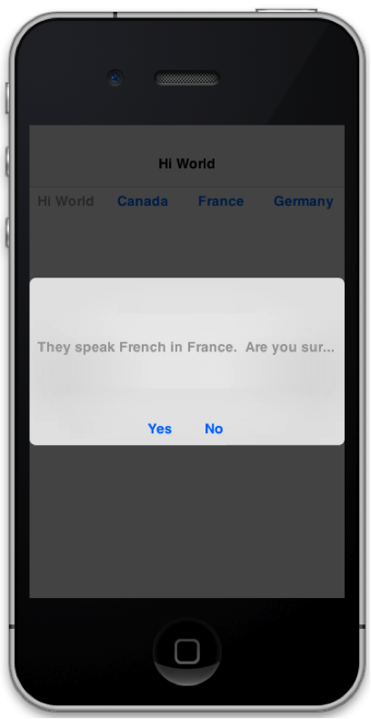
Note:  Depending on the skin you have selected for the simulator (and associated device resolution), you may see that the message in the dialog gets truncated as in the screenshot above.  This is because we are using a Label component for the message, which does not support text wrapping.  We’ll deal with that next.  For now, you should observe that clicking “Yes” will take you to the “France” form, and clicking “No” will just close the dialog (and return to the main form.
9.	Close the simulator and return to the Resource Editor.
10.	Delete the label on the dialog and replace it with a Span Label.  Add the same text to the span label.  (You’ll need to add the text in the property editor as span label doesn’t allow you to add the text directly).  The form editor should look something like the following after this is done:
 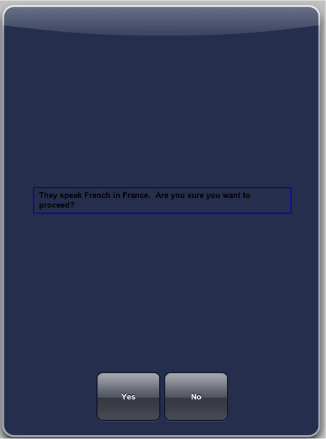
11.	Run the app again.  When you click on France, you should see the dialog open with a message that wraps properly if it is too long for the line:
 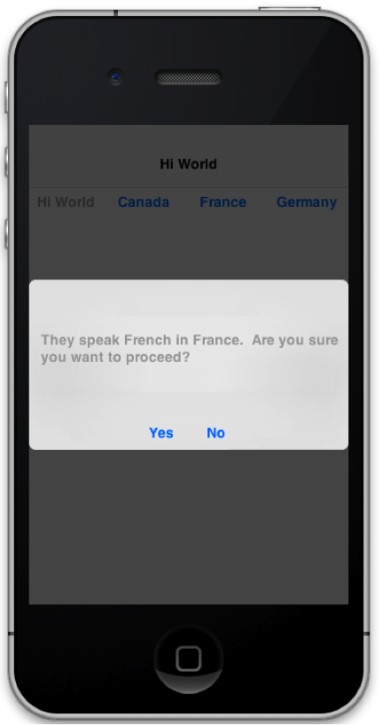

***Part 4: Reusing the Dialog***

It is quite common to want to make programmatic customizations to forms and dialogs before they are shown.  The “Before Show” event (see the Events tab of the property inspector) is one place to do this.

Modify the navigation to Canada and Germany so that they display the same dialog as France does, except with different/appropriate messages.  For the purpose of this exercise, you should not create any new dialogs in the GUI builder.  You should use the same dialog, except that you will use the Before Show event of the dialog to customize the label text.

The “Yes” and “No” button actions should also be modified to perform the appropriate action.  (E.g. when you click “Yes” after having selected “Canada”, you should be taken to the Canada form and not the French form).
Some useful tips:
•	The StateMachine class inherits lots of useful findXXX() methods for getting references to GUI elements on the form.  E.g.  You can get a reference to the “Yes” button with findYesButton(Component)  (this is because the “yes” button is named “yesButton” in the GUI builder.
•	You should always use the findXXX() variant that takes a component as a parameter.  This component can be the form, or any component on the form.
•	You might want to change the name of the span label in our dialog to make it easier to find using the findXXX() methods.
## Themes
### Exercise


One of the most powerful aspects of Codename One is its support for custom themes.  In this exercise, we will use some graphic assets and fonts to create a custom theme that looks like:

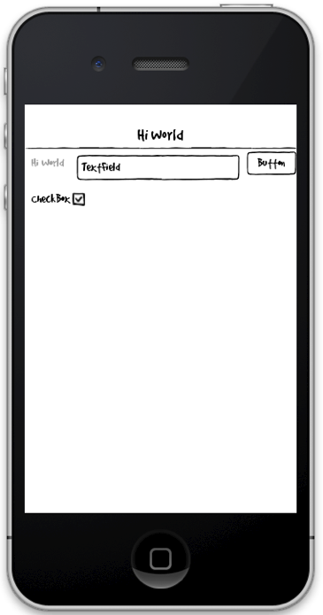
 
Steps:


1.	Override the Form, TextField, Label, Button, Title, TitleArea, and CheckBox styles to achieve this look.
2.	Override the relevant constants for the checked and unchecked images  of checkboxes.

Some helpful hints:

1. Download an existing theme, open it up in the Resource Editor and look at the different theme constants and UIIDs that are used.  E.g.  The [iPhone Theme](https://codenameone.googlecode.com/svn/trunk/Ports/iOSPort/src/iPhoneTheme.res)

References:

1.	You can download the [Good Dog font](https://github.com/shannah/oscon2014-ex5/blob/master/Jolly%20UI%20Free/fonts/good_dog/GOODDP__.ttf)
2.	You can download the necessary image assets [here](https://github.com/shannah/oscon2014-ex5/tree/master/Jolly%20UI%20Free/exports)
3.	The graphics for this theme were obtained from the Jolly UI Free kit (http://handdrawngoods.com/store/jolly-ui-free-hand-drawn-ui-kit/).
4.	The font is Good Dog, obtained here: http://www.dafont.com/good-dog.font

##Generic List Renderer

The Generic List Renderer provides an (arguably) easier mechanism for rendering complex lists.  It assumes that the model objects are Maps (e.g. Hashtable or HashMap), and the component prototype (i.e. the render cell component) has named components that take their values from the corresponding named entry in the model Map.

* [Example project](https://github.com/shannah/oscon2014-ex7/)
* [Example State Machine](https://github.com/shannah/oscon2014-ex7/blob/master/src/userclasses/StateMachine.java)

In the above example project, the "prototype" components are created in the GUI builder.  Then the renderer is created in the beforeMain() method of the state machine.

### Exercise : Youtube Navigator

***Steps***

Create a new GUI builder app.

We will create a Video class for our application to act as a model for the videos we load from YouTube.  You can download this class from [GitHub](https://github.com/shannah/oscon2014-ex7/blob/part1/src/ca/weblite/oscon/ex7/Video.java)

In the state machine, add a utility method to fetch a JSON video list from YouTube.

~~~
    private java.util.List<Video> fetchVideoList(String url){
        final ArrayList<Video> out = new ArrayList<Video>();
        ConnectionRequest req = new ConnectionRequest(){

            @Override
            protected void readResponse(InputStream input) throws IOException {
                JSONParser p = new JSONParser();
                Map data = p.parseJSON(new InputStreamReader(input, "UTF-8"));
                data = (Map)data.get("data");
                java.util.List<Map> items = (java.util.List<Map>)data.get("items");
                for (Map item : items){
                    Video v = new Video();
                    v.setId((String)item.get("id"));
                    v.setTitle((String)item.get("title"));
                    v.setDescription((String)item.get("description"));
                    Map thumb = (Map)item.get("thumbnail");
                    v.setThumbnailUrl((String)thumb.get("hqDefault"));
                    Map content = (Map)item.get("content");
                    //v.setVideoUrl((String)content.get("5"));
                    v.setVideoUrl("https://www.youtube.com/embed/"+v.getId()+"?feature=player_embedded&html5=1");
                    //Map player = (Map)item.get("player");
                    //v.setVideoUrl((String)player.get("default"));
                    v.setCategory((String)item.get("category"));
                    v.setUploader((String)item.get("uploader"));
                    out.add(v);
                }
            }
            
        };
        req.setUrl(url);
        req.setPost(false);
        NetworkManager.getInstance().addToQueueAndWait(req);
        
        return out;
        
    }
~~~

In the main form, in the GUI builder, set the layout to BorderLayout and add a List in the center panel.  Name this list "videoList".

Using the "Events" tab of the property inspector, click the "List Model" button.  This will create a method in your state machine:

~~~
    @Override
    protected boolean initListModelVideoList(List cmp) {}
~~~

Add some private variables to the StateMachine class:

~~~
private java.util.List<Video> videoList;
private static String feedURL = "https://gdata.youtube.com/feeds/api/videos?q=xataface&max-results=30&v=2&alt=jsonc&orderby=published";
~~~

Now implement the initListModelVideoList method:

~~~
    @Override
    protected boolean initListModelVideoList(List cmp) {
        final java.util.List<Video> vids = new ArrayList<Video>();
        if ( videoList.isEmpty()){
            Display.getInstance().invokeAndBlock(new Runnable(){

                public void run() {
                    
                    videoList.addAll(fetchVideoList(feedURL));
                }
                
            });
        }
        vids.addAll(videoList);
        
        Map[] data = new Map[vids.size()];
        int i=0;
        for ( Video video : vids ){
            Map item = new HashMap();
            item.put("video", video);
            item.put("staticUploadedBy", "Uploaded by");
            item.put("staticOn", "on");
            item.put("thumbnail_URLImage", video.getThumbnailUrl());
            item.put("thumbnail_URLImageName", video.getId()+"Thumb");
            
            item.put("title", video.getTitle());
            item.put("description", video.getDescription());
            item.put("uploader", video.getUploader());
            item.put("uploadDate", video.getUploadDate());
            
            //Log.p(item+"");
            data[i++] = item;
            
        }
        
        cmp.setModel(new com.codename1.ui.list.DefaultListModel(data));
        
        return true;
    }

~~~

Notice that we are creating a list model of Maps from our Video list.  This is because we intend to use the GenericListRenderer and it only works with Map models.

#### Creating the Renderer

Add a new GUI element named VideoCellRenderer, of type "Blank Container".

….

#Local Builds
#Unit Tests
#Other Components
##Web Browser
##Maps (Lightweight and Native)
#Javascript Bridge
#Graphics
##2D Graphics
##3D Graphics
##Animations
#Transitions

